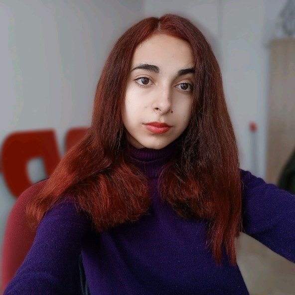
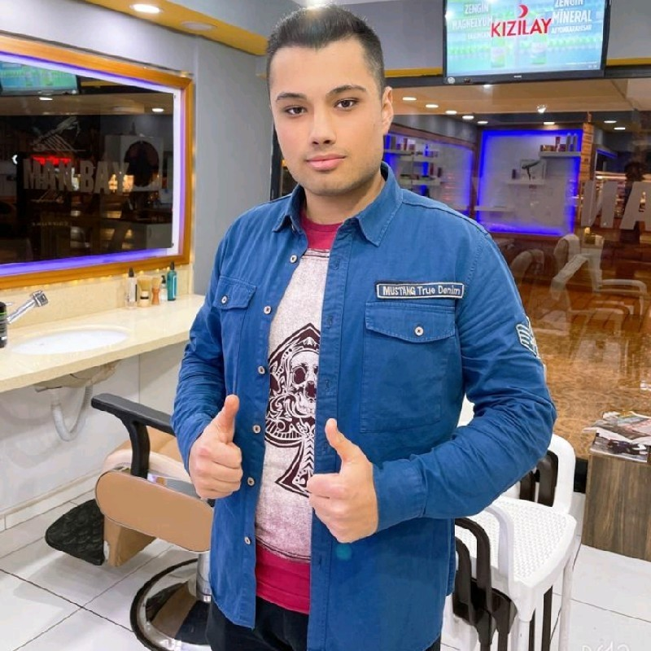
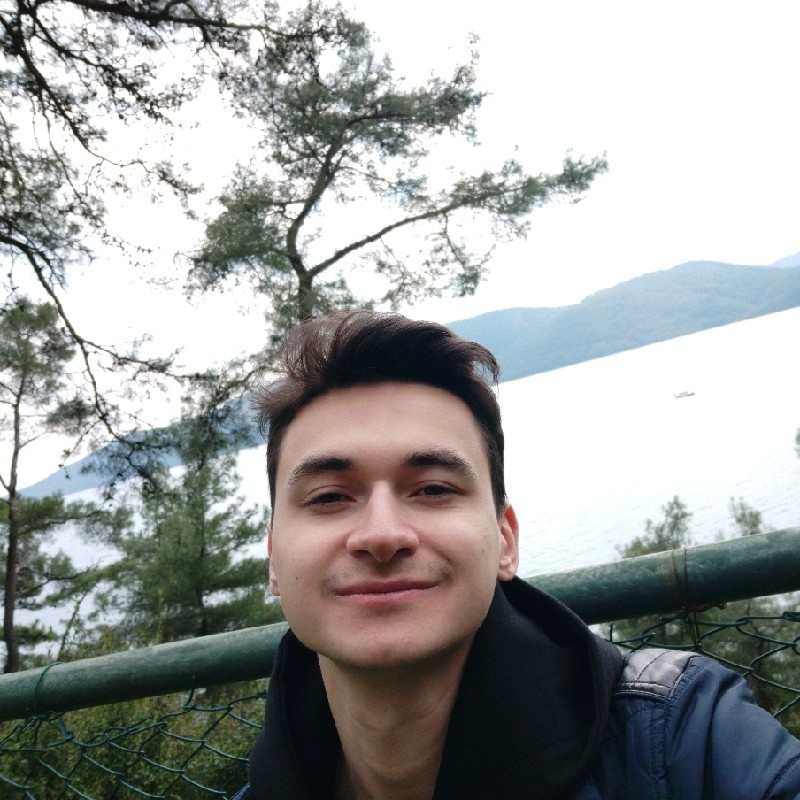
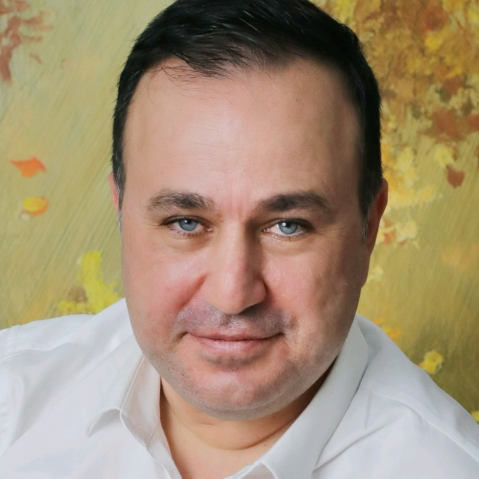
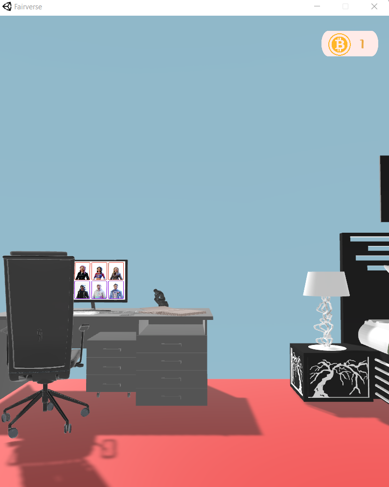
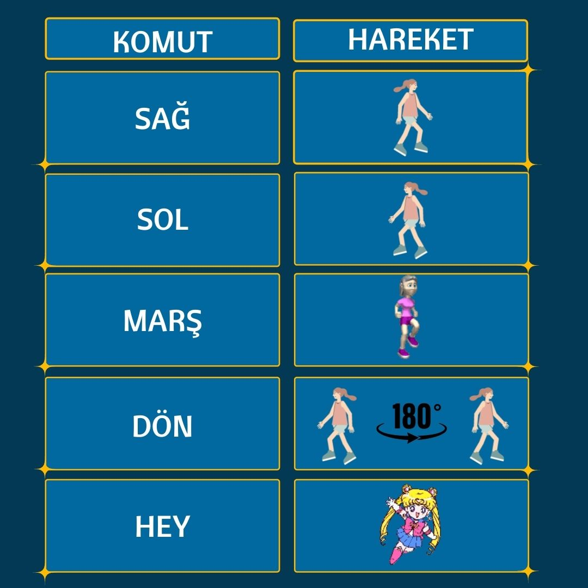

## Engelsiz Adil Evren (Fairverse):blush:

##  BİZ KİMİZ? :blush:

####  Bizler Muğla Sıtkı Koçman Üniversitesi Bilgisayar Mühendisliği öğrencileri olarak halihazırda yazılım dillerini öğrenen ve öğrenmeye devam eden, teknoloji meraklısı gençleriz. Yeni teknolojilere açığız ve geleceğe yön vermek istiyoruz. Okulumuzda bulunan Metaverse Araştırma Grubu (MvRG) ile son günlerde revaçta olan metaverse konusunda kendimizi geliştiriyoruz. Takım olarak amacımız; metaverse kavramını kullanarak hayatımızı kolaylaştıracak teknolojik ve yenilikçi içeriklere sahip projelere imza atmaktır. Bu açıdan sosyal faydayı gözeten ve engelli bireylerin erişebilirliklerini arttırabilecek bir proje fikri bizi heyecanlandırıyor.

#

##  EKİP ÜYELERİMİZ :blush:

###   REYHAN DUYGU -BİLGİSAYAR MÜHENDİSLİĞİ ÖĞRENCİSİ      

###   HAKKICAN BÜLÜÇ -BİLGİSAYAR MÜHENDİSLİĞİ ÖĞRENCİSİ      

###   ENES ATALAY -BİLGİSAYAR MÜHENDİSLİĞİ ÖĞRENCİSİ     

#
##  DANIŞMAN HOCAMIZ
#
###  DR. ENİS KARAARSLAN

#

##  PROJENİN AMACI :smirk:
#### Sahip olduğu rahatsızlıklardan dolayı hareket edemeyen insanların; engelsiz bir şekilde yaşamıdeneyim etmeleri amaçlanmaktadır. Hedef kullanıcılar; fiziksel engele sahip olup konuşma ve görme yeteneğine sahip bireylerdir. Engelsiz Adil Evren projemiz ile bu fiziksel engele sahip bireylerin erişebilirliklerini arttırmanın ve kendilerine ait bir ortam oluşturmalarının sağlanması hedeflenmektedir. Bunun için oluşturulacak sanal ortamda; engelsiz avatarların sesli komutlarla hareket edebilmeleri hedeflenecektir. Arayüzün; fiziksel engele sahip bireylerin oturarak ya da uzanarak kullanabilecekleri biçimde olmasına ve kullanımın kolaylığına dikkat edilecektir. 

#
##  NELER YAPTIK? :smirk:

###  ANİMASYONLAR

[SAĞA DÖNME ANİMASYONU](https://youtu.be/0h8hvZsVoZ8 "Sağa dönme animasyonu")

[SOLA DÖNME ANİMASYONU](https://youtu.be/IZbs8mHMog4 "Sola dönme animasyonu")

[İLERİ GİTME ANİMASYONU](https://youtu.be/_WZcwKDqFUA "İleri gitme animasyonu")

[DÖNME ANİMASYONU](https://youtu.be/NYCwgUyq0I8 "Dönme animasyonu")

[EL SALLAMA ANİMASYONU](https://youtu.be/kql0C48YUuI "El sallama animasyonu")

### SANAL AYNA PROTOTİPİMİZ

### UYGULAMA ÇIKTIMIZ

### MENÜ EKRANIMIZ

